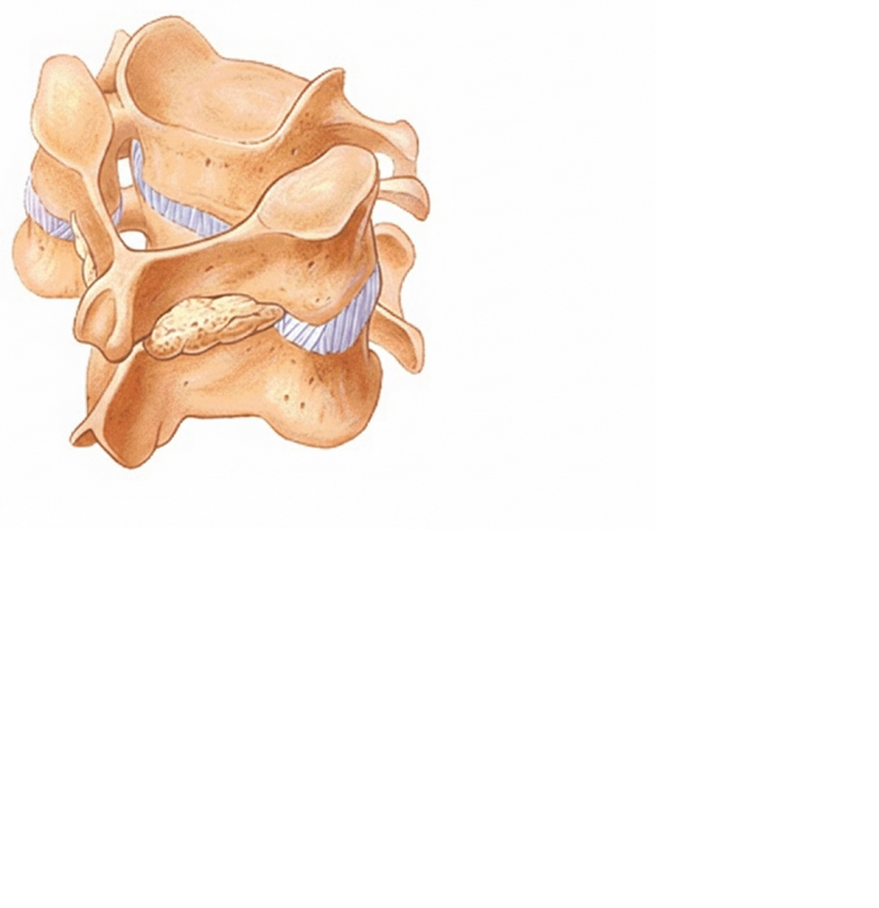
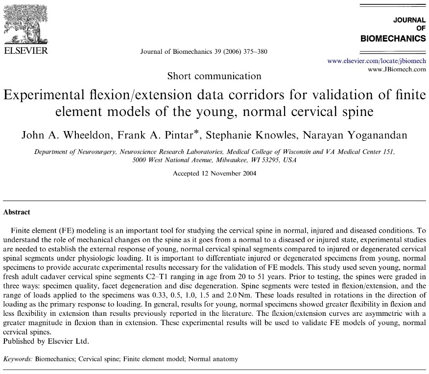
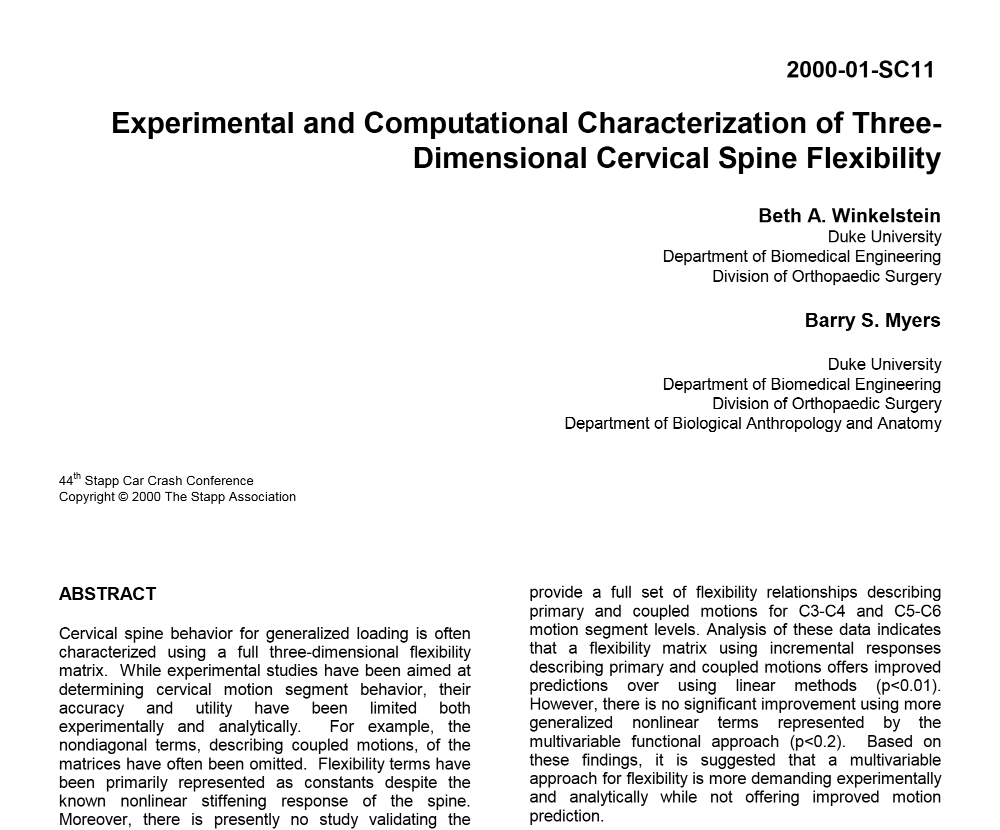
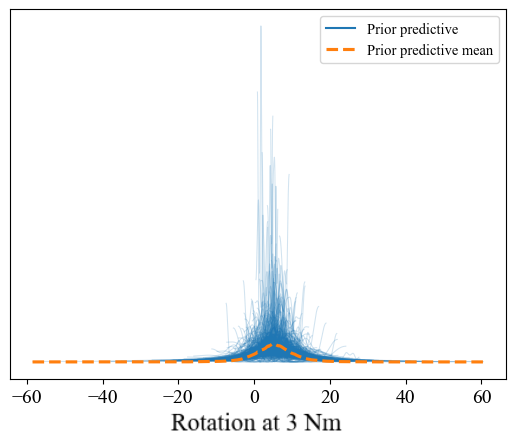
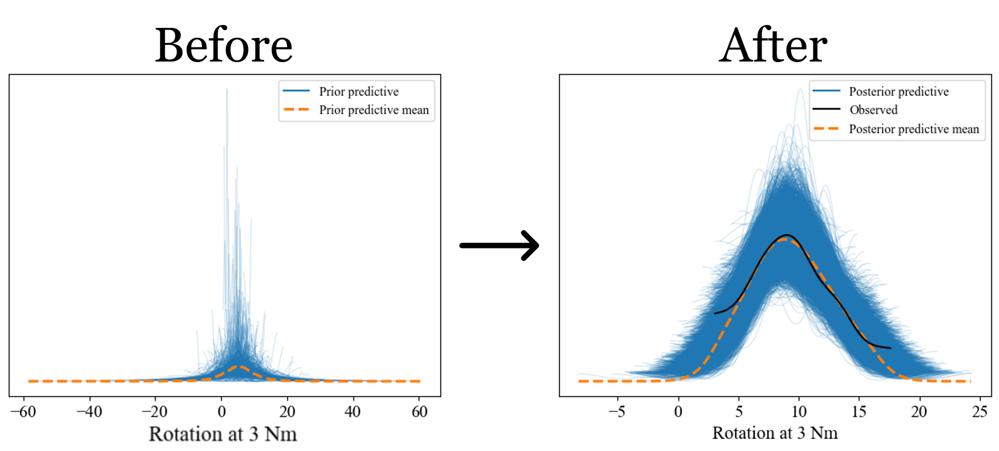
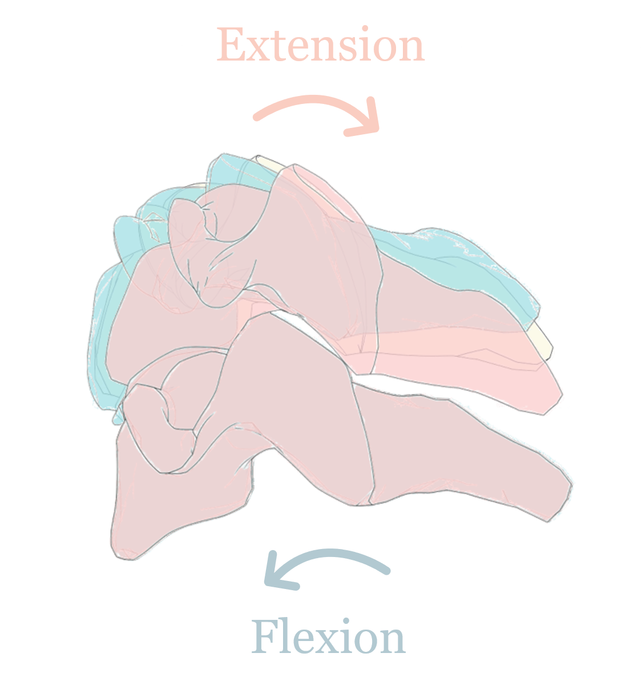
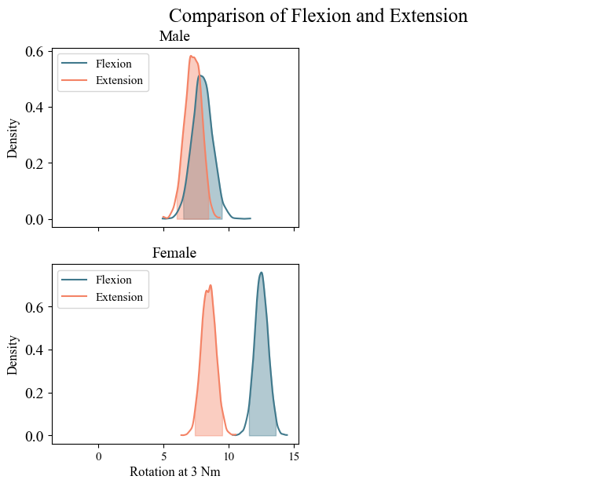
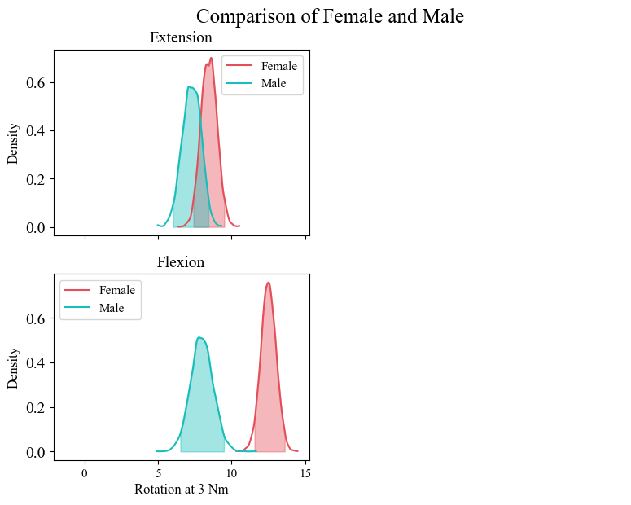
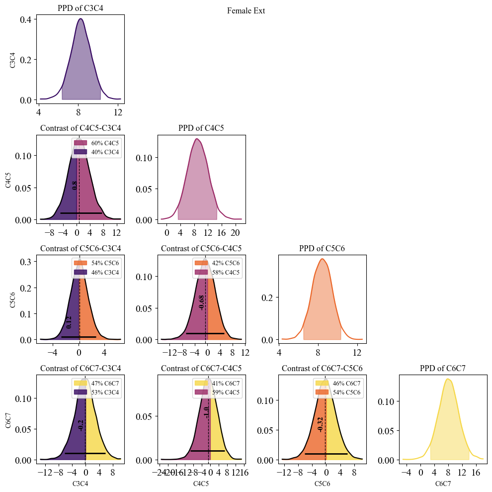

##  {background-color="white"}

 

::: {style="font-size: 1.5em;"}
**Comparison of Flexion–Extension Responses between Male and Female sub-Axial Cervical Spine Segments**
:::

 

[*Pranav Duraisamy*]{.underline}*, Davidson Jebaseelan, Jobin D. John*

::: footer
IRCOBI Europe 2025 \| Vilnius \| 11 Sept 2025
:::

::: notes
Hi, Im pranav, recently completed my bachelors in mech. This study is an outcome of my bachelor's pjt thesis. It mainly focused on sex differences in subaxial c spine segments.
:::

## Introduction 

:::::: columns
:::: { .column width="50%" style="font-size: 0.9em;"}

::: {.fragment .fade-in fragment-index=1}
-   Cervical spine segment - Two vertebra, Soft tissues
-   Female have more risk of neck injury than male in traffic accidents
:::

::: {.fragment .fade-in fragment-index=2}
-   Recent dummies and HBMs also focus on average female
-   Sex-specific calibration and validation are either limited or non-existent
:::

::::

:::: {.column width="50%"}

::: r-stack

{.fragment fragment-index=1}

{.fragment fragment-index=2}

:::

::::

::: notes
I can see many ppl in this hall who were majorly working on spine biomech. To give a brief intro on C spine segments. It consists of 2 vertebra, and some ligaments in between like CL, ligamentum flavum, articular processes and so on.. then there is also IVD which have Annulus fibers and nucleus. Spinal injuries esp neck injuries in women are more than men specifically in traffic accidents. To study the injury in female,  We use female HBM. However female HBMs are morphed versions of male HBMs and sex specific validation is not done on those models.
:::

::::::

## Objective {.center style="text-align: center"}

Quantify the [**differences between the male and female cervical spine segments**]{style="color:red;"} in flexion and extension

::: notes
That leads to the objective of this study, thats to quantify the differences between the male and female cervical spine segments in flexion and extension
:::

## A Bit of Background...

::: r-stack

{.fragment .absolute width="500" top="12%" left="15%"}

{.fragment .absolute width="500" top="37%" left="27%"}

:::

::: notes
Let's take a look at some avl data that is related to this study. In some experiments, there were both male & female specimens but in the analysis everything was clubbed together. So we dunno the diff bw male & female. For example, this study by Wheeldon et al. Then we have this study by winkelstein et al but all the specimens in this study were male. 
:::

## A Bit of Background... {visibility="uncounted"}

::: r-stack

{.fragment .absolute  top="14%" left="1%" width="500" fragment-index=1}

{.fragment .absolute top="40%" left="5%" width="500" fragment-index=2}

{.fragment .absolute top="27%" left="60%" width="400" fragment-index=3}

:::

[Experimental setup used by Nightingale et al.]{.fragment fragment-index=3 .absolute top="68%" left="60%" width="400" style="font-size: 80%;"}

::: notes
Finally we have these studies by nightingale, where the data for male & female were reported separately & its available openly in NHTSA database. the exp setup was same for both the nightingale studies. so it can be made as a comparable study which was not done by the original author. c spine segments were cut from unembalmed pmhs and tested in flexibility & failure tests
:::

# Methods

## Exploratory Data Analysis

{fig-align="center" height="550"}

::: notes
This slide shows no of specimens tested. just for the moment, consider c3c4 there are 11 specimens for female but there is only 1 specimen for its very adjacent c4c5 . this is because of the segmentation of fsus. same trend follows for male too but different segments.
:::

## Exploratory Data Analysis 

{fig-align="center"}

::: notes
This plot shows the distribution of rotation angle at 3nm. you could see that even in this eda that the extension is similar in male & female but thats not the case for flexion. females rot angle is higher than male.
:::

## Concept behind Linear Regression

::: r-stack

{.fragment .fade-in-then-out .absolute height="500" top="18%" left="25%"}

{.fragment .fade-in-then-out .absolute height="500" top="18%" left="25%"}

{.fragment .fade-in .absolute height="500" top="18%" left="25%"}

:::

::: notes
This is the linear reg as we know it, there will be a set of points, we fit the line & the residuals would be normally distributed. behind the screen you would use MLE or least squares or smthng similar to minimise these residuals.
:::

## Classical vs Bayesian Regression

::::: columns

:::: {.column width="50%" style="font-size: 90%;" .fragment}

#### MLE Approach

\text{From Line of Best Fit,}
\begin{align}
Y &= \alpha + \beta X ± \sigma\\
 \\
\alpha &= \text{Constant (Intercept)}\\
\beta &= \text{Constant (Slope)}\\
\sigma &\sim \text{Normally distributed}
\end{align}

::::

:::: {.column width="50%" style="font-size: 90%;" .fragment}

#### Probabilistic Approach
\begin{align} 
Y &\sim \operatorname{N}(\mu,~\sigma)\\
\mu &= \alpha + \beta X\\
\alpha &\sim \text{A distribution}\\
\beta &\sim \text{Another distribution}\\
\sigma &\sim \text{Some other distribution}\\
\end{align}

::::

::: notes
From the line of best fit, you could find the parameters a & b as consts. another approach is to do bayesian linear reg. where these parameters are estimated as probability distributions
:::

:::::

## Bayesian Analysis - In a nutshell

{fig-align="center" height="450"}

::: aside 
Adapted from *Bayesian Analysis with Python by Oswaldo Martin*
:::

::: notes
As you can see here bayesian is other way around than a classical regression. all the relations are probabilistic than deterministic. every parameter whether it can be slope, intercept or even output variable is a probability distribution than singular values.
:::

## Bayesian Model Building {.r-fit-text}

:::::: columns

::::: {.column width="50%" style="font-size: 60%;"}

\begin{align}
L_i &= \text{Coeff. for loading mode}\\
l_{ij} &= \text{Coeff. for loading mode specific to sex}\\
E &= \text{Residual random error}\\
\end{align}

{.absolute top="33%" height="60%"}
:::::

::::: {.column width="45%" style="font-size: 68%;"}

**R = Segmental rotation angle at 3Nm**

:::::

::::::

::: notes
Coming back to this study, we know that when 3nm moment is applied, the rotation would be more than 0 deg and from previous studies we know that it wont be more than 20 deg. we use that prior information as a starting point for fitting. we used a hierarchical model in which sex was treated as level. so that each flex & ext have diff parameters for male & female
:::

# Results & Discussion

## Prior to Posterior Predictive

{fig-align="center"}

::: notes
If you compare the x-axis of both the plots, you could find that plausible range for rotation angle at 3Nm got shrinked after fitting the nightingale data to the model. Also the mean of all the samples (blue lines) are closely aligned with the observed data.

:::

## Posterior Distributions

{fig-align="center"}

::::: columns

:::: {.column width="30%"}

::: {data-id="txt2" style="font-size: 70%; text-align: right; position: absolute; top: 157px; left: 52px;" .fragment .fade-in fragment-index=1}
Coeff. for loading mode
:::

::: {data-id="txt4" style="font-size: 70%; text-align: right; position: absolute; top: 378px; left: 13px;" .fragment .fade-in fragment-index=2}
Coeff. for loading mode specific to sex
:::

::::

:::: {.column width="60%"}

::::

::: {.gradient-border-box .absolute top="212" left="215" height="74" width="450" .fragment .fade-in fragment-index=1}
:::

::: {.gradient-border-box .absolute top="435" left="215" height="158" width="450" .fragment .fade-in fragment-index=2}
:::

:::::

::: notes
we can see the dist of coeff for loading are similar in ext & flex. they are literally on top of each other. but if you look at this, the coeff for multilevel loading given sex in Ext, male & female are similar. but in flexion, we can see a clear difference between male & female.
:::

## Comparison: Flexion & Extension

::::: columns

:::: {.column width="30%"}

{.absolute top="25%" width="375"}

::::

:::: {.column width="70%"}

::: r-stack

{.fragment height="575"}

{.fragment height="575"}

:::

::::

:::::

::: notes
You could see a more fancier version of previous plot in this slide. In male, the top left plot, the dist of segmental rot at 3nm. the dist of flex & ext, they overlap, they are not different. Then if you look at the left bottom plot, for female, the ext is similar to male & the flex is higher & they dont overlap. And we can quantify that using contrast plots. the contrast dist is a diff of 2 dist. And in this case its the difference of flex & ext. if yu look for male in top right , its distributed around 0 which means there is no diff between flex & ext. But when we come to the female, we see the contrast dist is not abt 0, rather its about 4 deg showing that there is significant diff b/w flex & ext in female. 
:::

## Comparison: Female & Male

::: r-stack

{.fragment height="575"}

{.fragment height="575"}

:::

::: notes
Now we can see the data in a different way also. you could see the differnece in male & female in extension which is in top row.. and flexion is in bottom row. Anyways we see similar differences. 
:::

## Conclusion

- Male and female segments in **extension tends to be similar**
- But **in flexion, the female rotation was 4.5° more** 
than male in average
- Female cervical spine segmental kinematics ***cannot*** be considered as size-scaled versions of male

::: notes
key take aways from this study are:
:::

## Acknowledgement

- Travel Grant for IRCOBI 2025 by Toyota 
- ANRF-SERB-CRG (CRG/2023/004727) in India
- SPARC (SP23241582EDSPAR008343) in India
- Swedish Transport Administration/Trafikverket grant (TRV2024/107142)

{fig-align="center"}

::: notes
Finally, i would like to acknowledge all the grants recieved for this study
:::

##  {background-color="white"}

::: {style="font-size: 1.5em;"}
**Comparison of Flexion–Extension Responses between Male and Female sub-Axial Cervical Spine Segments**
:::

::: {style="font-size: 0.8em;"}
[*Pranav Duraisamy*]{.underline}*, Davidson Jebaseelan, Jobin D. John*
:::

::: footer
IRCOBI Europe 2025 \| Vilnius \| 11 Sept 2025
:::

# ✨ Bonus Slides ✨ {.center style="text-align: center"}

## Data Extraction {.smaller}

- Extracted reports and ASCII data from NHTSA database using API
- Consists of spine segments from [16 female and 16 male PMHS]{.fragment .highlight-red}
- After filtering and processing, there were [48 female and 29 male FSUs]{.fragment .highlight-red}
- Out of which [36 are tested for flexion while 41 are tested for extension]{.fragment .highlight-red} 

::: {.callout-tip title="Inclusion Criteria"}
-   Flexibility Tests
-   Rotation angle interpolated at 3Nm
-   Sub-Axial Cervical segments (C3 to C7)
:::

::: notes
meow meow
:::

## Bayesian Model Building {.r-fit-text}

:::::: columns
::::: {.column width="50%" style="font-size: 60%;"}

\begin{align}
L_i &= \text{Coeff. for loading mode}\\

l_{ij} &= \text{Coeff. for loading mode specific to sex}\\

E &= \text{Residual random error}\\

R &=\text{Segmental Rotation angle at 3Nm}\\

\end{align}

:::: r-stack

:::{.fragment .fade-in-then-out fragment-index=1 style="color: #004030;"}

### Common Effect

$$ 
L_{i} \sim \operatorname{Normal}(\mu_{i},~\sigma_{i}) 
$$

$$
\mu_{i} = 
\left\{ 
    \begin{array}{ll}
        5.3 & \textrm{for Extension} \\
        5.8 & \textrm{for Flexion} 
    \end{array}
\right.
$$

$$
\sigma_{i} = 
\left\{ 
    \begin{array}{ll}
        2.3 & \textrm{for Extension} \\
        2.9 & \textrm{for Flexion}
    \end{array}
\right.
$$
:::

:::{.fragment .fade-in-then-out fragment-index=2 style="color: #2F5249;"}

### Group-level Effect

$$ 
l_{ij} \sim \operatorname{Normal}(0,~\sigma_{l_{i}}) 
$$

:::

:::{.fragment .fade-in-then-out fragment-index=3 style="color: #437057;"}

### Hyperprior

$$ \sigma_{l_{i}} \sim \operatorname{HalfNormal}(\tau_{i}) $$

$$
\tau_{i} = 
\left\{ 
    \begin{array}{ll}
        2.3 & \textrm{for Extension} \\
        2.9 & \textrm{for Flexion}
    \end{array}
\right.
$$

:::

:::{.fragment .fade-in-then-out fragment-index=4 style="color: #97B067;"}

### Residual Error

$$ E \sim \operatorname{Normal}(0,~\sigma_{E}) $$

$$ \sigma_{E} \sim \operatorname{HalfStudentT}(\nu,~\sigma) $$

$$ \nu = 4, \sigma = 3.4 $$

:::

:::{.fragment .fade-in-then-out fragment-index=5 style="color: #FFCC00;"}

### Likelihood & Posterior

$$ R = L_{i} + l_{ij} + E $$

:::

::::

:::::

::::: {.column width="45%"}

::: {data-id="box1" style="background: #ffffff00; width: 125px; height: 110px; position: absolute; top: 215px; left: 527px; border: 5px solid #004030; border-radius: 15px; z-index:30" .fragment .fade-in-then-out fragment-index=1}
:::

::: {data-id="box2" style="background: #ffffff00; width: 185px; height: 240px; position: absolute; top: 85px; left: 665px; border: 5px solid #2F5249; border-radius: 15px; z-index:30" .fragment .fade-in-then-out fragment-index=2}
:::

::: {data-id="box3" style="background: #ffffff00; width: 125px; height: 110px; position: absolute; top: 85px; left: 725px; border: 5px solid #437057; border-radius: 15px; z-index:30" .fragment .fade-in-then-out fragment-index=3}
:::

::: {data-id="box4" style="background: #ffffff00; width: 180px; height: 240px; position: absolute; top: 85px; left: 800px; border: 5px solid #97B067; border-radius: 15px; z-index:30" .fragment .fade-in-then-out fragment-index=4}
:::

::: {data-id="box5" style="background: #ffffff00; width: 120px; height: 175px; position: absolute; top: 400px; left: 665px; border: 5px solid #FFCC00; border-radius: 15px; z-index:30" .fragment .fade-in-then-out fragment-index=5}
:::

:::::

::::::

::: notes
meow meow 
:::

## Bayesian Model Building

- Bambi v0.14.0 (python package) was used for building the Bayesian models
- Used weakly informative priors from other studies ^[Winkelstein et al., (2000)]
- Sampled using MCMC NUTS sampler in 4 chains, each with 1500 draws
- Posterior predictive distributions were used for comparing the responses

::: notes
meow meow 
:::

## Posterior Distributions

::::: columns

:::: {.column width="40%"}

  
  

::: {.callout-tip title="What is posterior?" .fragment .fade-out fragment-index=1}
-   Probability distribution for the parameters in the model after sampling
-   Reflects all we know about the problem
:::

::: {data-id="txt1" style="font-size: 0.9em; text-align: right; position: absolute; top: 138px; left: 121px;" .fragment .fade-in fragment-index=1}
Residual Error
:::

::: {data-id="txt2" style="font-size: 0.9em; text-align: right; position: absolute; top: 220px; left: 102px;" .fragment .fade-in fragment-index=2}
Common Effect
:::

::: {data-id="txt3" style="font-size: 0.9em; text-align: right; position: absolute; top: 335px; left: 172px;" .fragment .fade-in fragment-index=3}
Hyperprior
:::

::: {data-id="txt4" style="font-size: 0.9em; text-align: right; position: absolute; top: 485px; left: 63px;" .fragment .fade-in fragment-index=4}
Group-level Effect
:::

::::

:::: {.column width="60%"}

{height="540"}

::::

::: {.gradient-border-box .absolute top="152" left="390" height="35" width="450" .fragment .fade-in fragment-index=1}
:::

::: {.gradient-border-box .absolute top="220" left="390" height="74" width="450" .fragment .fade-in fragment-index=2}
:::

::: {.gradient-border-box .absolute top="332" left="390" height="74" width="450" .fragment .fade-in fragment-index=3}
:::

::: {.gradient-border-box .absolute top="442" left="390" height="158" width="450" .fragment .fade-in fragment-index=4}
:::

:::::

::: notes
meow meow
:::

## Future Study

{fig-align="center"}