##  {background-color="white"}

 

::: {style="font-size: 1.5em;"}
**Comparison of Flexion–Extension Responses between Male and Female sub-Axial Cervical Spine Segments**
:::

 

[*Pranav Duraisamy*]{.underline}*, Davidson Jebaseelan, Jobin D. John*

::: footer
IRCOBI Europe 2025 \| Vilnius \| 11 Sept 2025
:::

## Introduction

:::::: columns
::: {.column width="50%"}
-   Recent dummies and HBMs also focus on average female
-   Male ⇌ Female HBM, *through Morphing*
-   Models were made to mimic *average female anthropometry*
:::

::: {.column width="50%"}
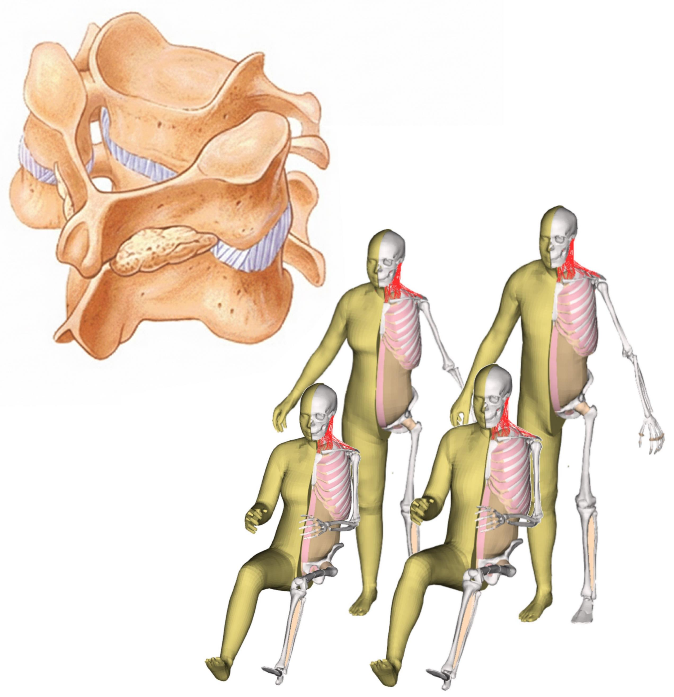
:::

::: notes
FE HBMs opens new possiblities in representing diverse populations. Most of the avg female HBMs are morphed from an avg male models, matching the node coords to represent a new anthropometry.. or sometimes vice versa from F to M.
:::
::::::

## Objective

Quantify the differences between the male and female cervical spine segments in flexion and extension

::: {.callout-tip title="Worth considering..."}
-   Female have more risk of neck injury male in traffic accidents
-   Generally, Sex-specific calibration and validation are either limited or non-existent
:::

::: notes
Just matching the anthropometry is not enough for a FE Model, We have to validate. but validating a F model remains a challange due to lack of F-specific experimental data. It is found to be common that Most of the studies analyzed without differentiating for sex (reported together). There are only few studies that have reported cervical spine response for F. Mostly M&F segments were used together for reporting or with no comparison between M&F.
:::

## A Bit of Background...

::: r-stack
{.fragment .absolute width="500" top="12%" left="15%"}

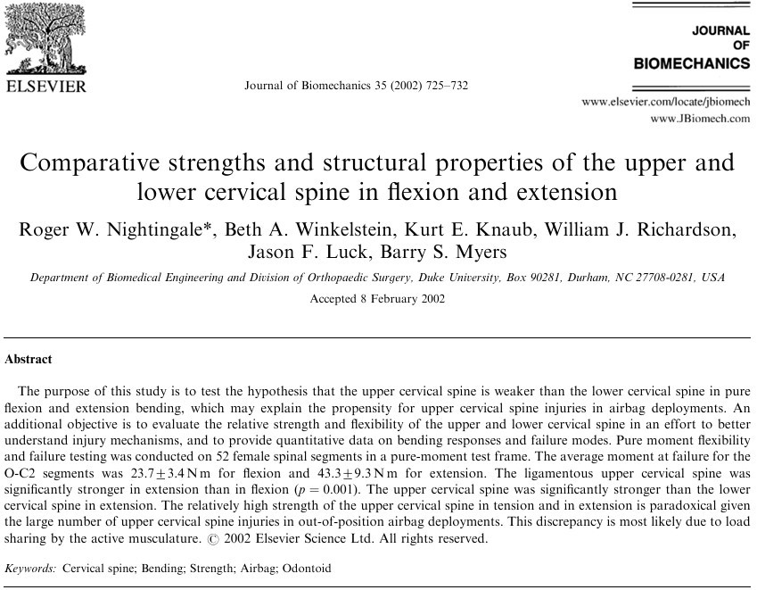{.fragment .absolute width="500" top="40%" left="27%"}

:::

## A Bit of Background... {visibility="uncounted"}

::::: columns

:::: {.column width="60%"}

::: {style="font-size: 0.8em;"}
-   Both studies are identical, differing only in sex of the specimens used
-   Unembalmed PMHS, Adjacent segments were lost during sectioning
-   Pure Moment Loads - Flexibility Tests (Max. 3.5Nm) & Failure Tests
:::

::: {.callout-note title="Mostly FSUs were segmented into..."}
Male → O-C3, [C4-C5 & C6-C7]{style="color:dodgerblue;"}

Female → O-C2, [C3-C4, C5-C6 & C7-T1]{style="color:deeppink;"}
:::

::::

:::: {.column width="40%"}
 

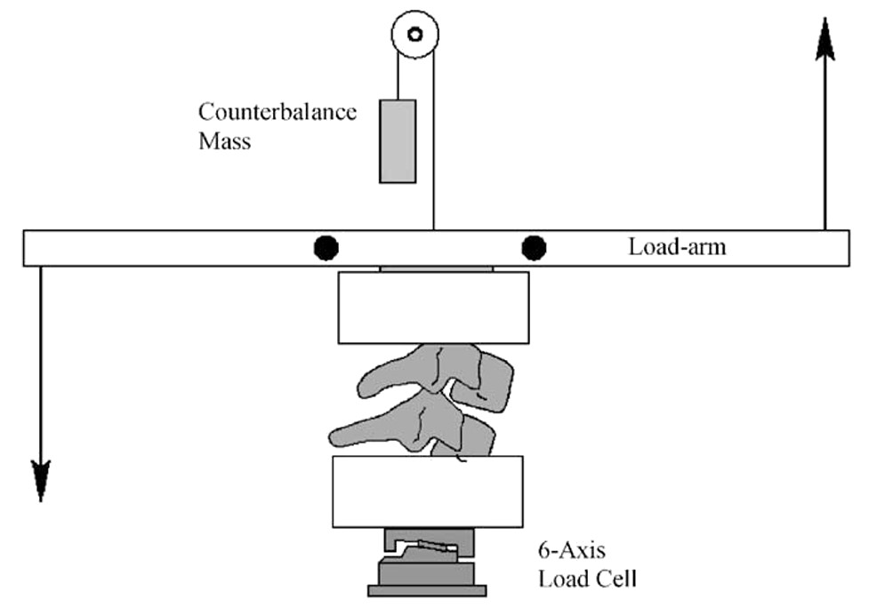
::::

:::::

::: notes
meow meow
:::

# Methods

## Data Extraction {.smaller}

- Extracted reports and ASCII data from NHTSA database using API
- Consists of spine segments from [16 female and 16 male PMHS]{.fragment .highlight-red}
- After filtering and processing, there were [48 female and 29 male FSUs]{.fragment .highlight-red}
- Out of which [36 are tested for flexion while 41 are tested for extension]{.fragment .highlight-red} 

::: {.callout-tip title="Inclusion Criteria"}
-   Flexibility Tests
-   Rotation angle interpolated at 3Nm
-   Sub-Axial Cervical segments (C3 to C7)
:::

::: notes
meow meow
:::

## Exploratory Data Analysis{.smaller}

:::: columns

::: {.column width=65%}
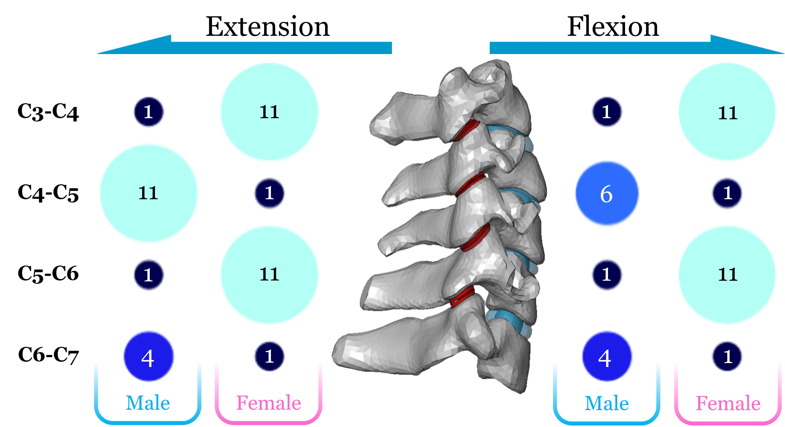
:::

::: {.column width=34%}
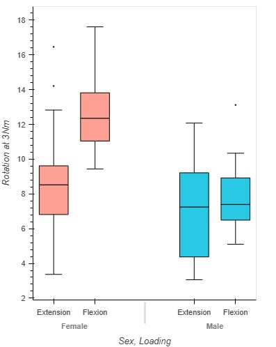
:::

::::

::: notes
meow meow
:::

## Bayesian Analysis - In a nutshell

##### Basic idea behind Linear Regression

::: r-stack

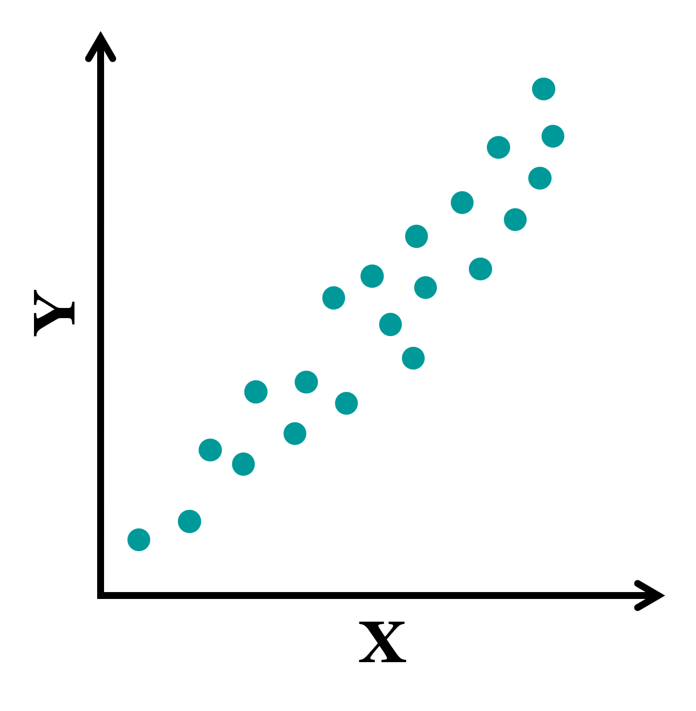{.fragment .fade-in-then-out .absolute height="450" top="18%" left="1%"}

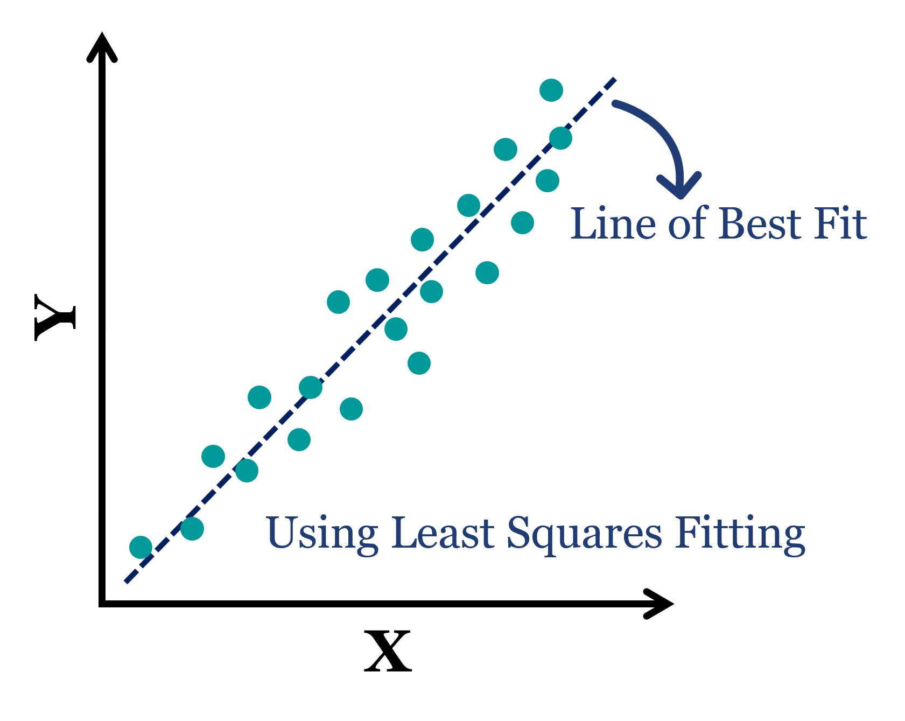{.fragment .fade-in-then-out .absolute height="450" top="18%" left="1%"}

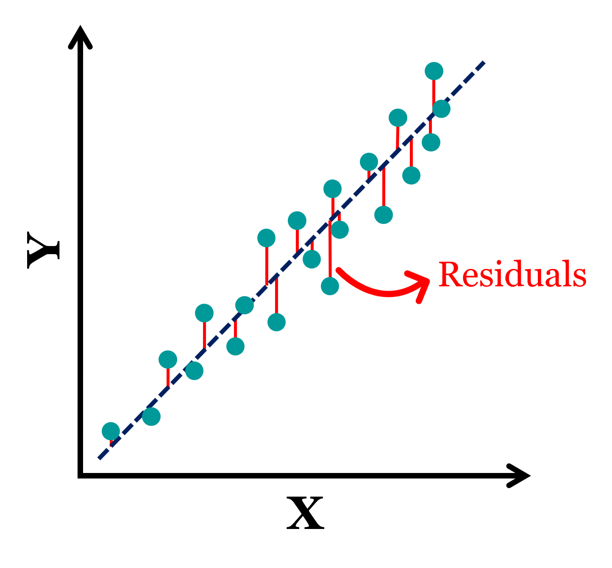{.fragment .fade-in-then-out .absolute height="450" top="18%" left="1%"}

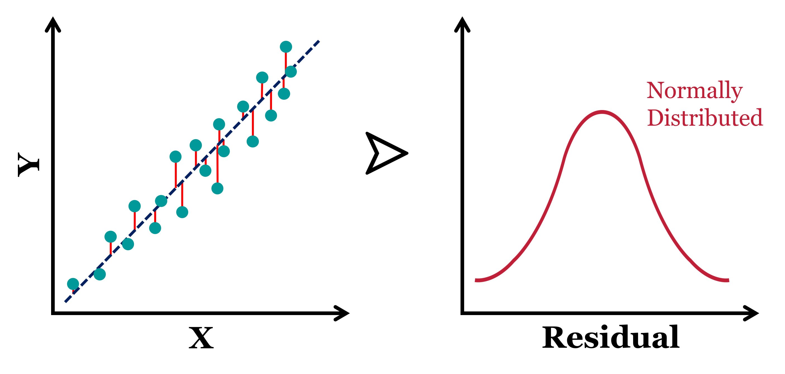{.fragment .fade-in-then-out .absolute height="450" top="18%" left="1%"}

:::

::: notes
meow meow
:::

## Bayesian Analysis - In a nutshell {visibility="uncounted" auto-animate="true" auto-animate-unmatched="slide"}

##### Doing it in a Bayesian way...

::::: columns
:::: {.column width="50%" style="font-size: 80%;"}

 

\begin{align} 
\alpha &\sim \text{a prior}\\
\beta &\sim \text{another prior}\\
\sigma &\sim \text{some other prior}\\
\mu &= \alpha + \beta X\\
Y &\sim \operatorname{N}(\mu,~\sigma)\\
Y &\sim \operatorname{N}(\mu = \alpha + \beta X,~\sigma)\\
\end{align}

::::

:::: {.column width="45%"}
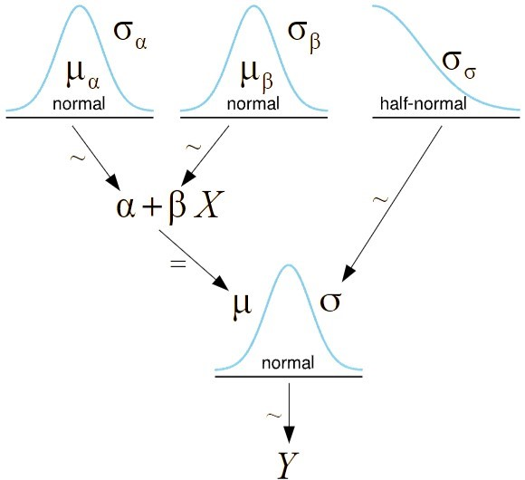
::::
:::::

::: aside 
Adapted from *Bayesian Analysis with Python by Oswaldo Martin*
:::

::: notes
meow meow
:::

## Bayesian Model Building {.r-fit-text}

:::::: columns
::::: {.column width="50%" style="font-size: 60%;"}

\begin{align}
L_i &= \text{Coeff. for loading mode}\\

l_{ij} &= \text{Coeff. for loading mode specific to sex}\\

E &= \text{Residual random error}\\

R &=\text{Segmental Rotation angle at 3Nm}\\

\end{align}

:::: r-stack

:::{.fragment .fade-in-then-out fragment-index=1 style="color: #004030;"}

### Common Effect

$$ 
L_{i} \sim \operatorname{Normal}(\mu_{i},~\sigma_{i}) 
$$

$$
\mu_{i} = 
\left\{ 
    \begin{array}{ll}
        5.3 & \textrm{for Extension} \\
        5.8 & \textrm{for Flexion} 
    \end{array}
\right.
$$

$$
\sigma_{i} = 
\left\{ 
    \begin{array}{ll}
        2.3 & \textrm{for Extension} \\
        2.9 & \textrm{for Flexion}
    \end{array}
\right.
$$
:::

:::{.fragment .fade-in-then-out fragment-index=2 style="color: #2F5249;"}

### Group-level Effect

$$ 
l_{ij} \sim \operatorname{Normal}(0,~\sigma_{l_{i}}) 
$$

:::

:::{.fragment .fade-in-then-out fragment-index=3 style="color: #437057;"}

### Hyperprior

$$ \sigma_{l_{i}} \sim \operatorname{HalfNormal}(\tau_{i}) $$

$$
\tau_{i} = 
\left\{ 
    \begin{array}{ll}
        2.3 & \textrm{for Extension} \\
        2.9 & \textrm{for Flexion}
    \end{array}
\right.
$$

:::

:::{.fragment .fade-in-then-out fragment-index=4 style="color: #97B067;"}

### Residual Error

$$ E \sim \operatorname{Normal}(0,~\sigma_{E}) $$

$$ \sigma_{E} \sim \operatorname{HalfStudentT}(\nu,~\sigma) $$

$$ \nu = 4, \sigma = 3.4 $$

:::

:::{.fragment .fade-in-then-out fragment-index=5 style="color: #FFCC00;"}

### Likelihood & Posterior

$$ R = L_{i} + l_{ij} + E $$

:::

::::

:::::

::::: {.column width="45%"}
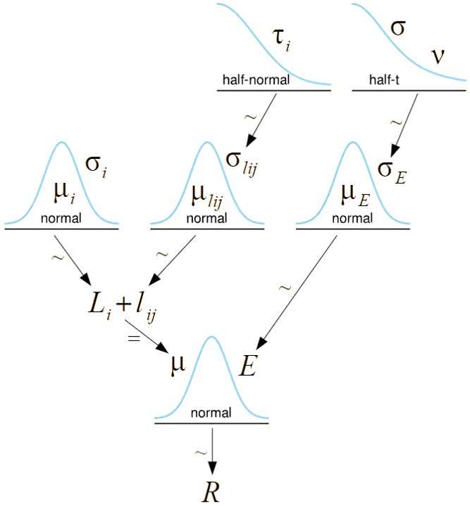

::: {data-id="box1" style="background: #ffffff00; width: 125px; height: 110px; position: absolute; top: 215px; left: 527px; border: 5px solid #004030; border-radius: 15px; z-index:30" .fragment .fade-in-then-out fragment-index=1}
:::

::: {data-id="box2" style="background: #ffffff00; width: 185px; height: 240px; position: absolute; top: 85px; left: 665px; border: 5px solid #2F5249; border-radius: 15px; z-index:30" .fragment .fade-in-then-out fragment-index=2}
:::

::: {data-id="box3" style="background: #ffffff00; width: 125px; height: 110px; position: absolute; top: 85px; left: 725px; border: 5px solid #437057; border-radius: 15px; z-index:30" .fragment .fade-in-then-out fragment-index=3}
:::

::: {data-id="box4" style="background: #ffffff00; width: 180px; height: 240px; position: absolute; top: 85px; left: 800px; border: 5px solid #97B067; border-radius: 15px; z-index:30" .fragment .fade-in-then-out fragment-index=4}
:::

::: {data-id="box5" style="background: #ffffff00; width: 120px; height: 175px; position: absolute; top: 400px; left: 672px; border: 5px solid #FFCC00; border-radius: 15px; z-index:30" .fragment .fade-in-then-out fragment-index=5}
:::

:::::

::::::

::: notes
meow meow 
:::

## Bayesian Model Building

- Bambi v0.14.0 (python package) was used for building the Bayesian models
- Used weakly informative priors from other studies ^[Winkelstein et al., (2000)]
- Sampled using MCMC NUTS sampler in 4 chains, each with 1500 draws
- Posterior predictive distributions were used for comparing the responses

# Results & Discussion

## Posterior Distributions

::::: columns

:::: {.column width="40%"}

  
  

::: {.callout-tip title="What is posterior?" .fragment .fade-out fragment-index=1}
-   Probability distribution for the parameters in our model after sampling
-   Reflects all we know about the problem
:::

::: {data-id="txt1" style="font-size: 0.9em; text-align: right; position: absolute; top: 138px; left: 121px;" .fragment .fade-in fragment-index=1}
Residual Error
:::

::: {data-id="txt2" style="font-size: 0.9em; text-align: right; position: absolute; top: 220px; left: 102px;" .fragment .fade-in fragment-index=2}
Common Effect
:::

::: {data-id="txt3" style="font-size: 0.9em; text-align: right; position: absolute; top: 335px; left: 172px;" .fragment .fade-in fragment-index=3}
Hyperprior
:::

::: {data-id="txt4" style="font-size: 0.9em; text-align: right; position: absolute; top: 485px; left: 63px;" .fragment .fade-in fragment-index=4}
Group-level Effect
:::

::::

:::: {.column width="60%"}

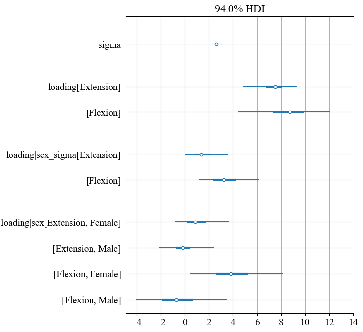{height="540"}

::::

::: {.gradient-border-box .absolute top="152" left="390" height="35" width="450" .fragment .fade-in fragment-index=1}
:::

::: {.gradient-border-box .absolute top="220" left="390" height="74" width="450" .fragment .fade-in fragment-index=2}
:::

::: {.gradient-border-box .absolute top="332" left="390" height="74" width="450" .fragment .fade-in fragment-index=3}
:::

::: {.gradient-border-box .absolute top="442" left="390" height="158" width="450" .fragment .fade-in fragment-index=4}
:::

:::::

::: notes
poterior is the result of baye ana. & reflects all we know about the problem. post is just a updated prior due to sampling in the light of a new data (fit data/ training data)
:::

## Contrast b/w Flexion & Extension

::::: columns

:::: {.column width="30%"}

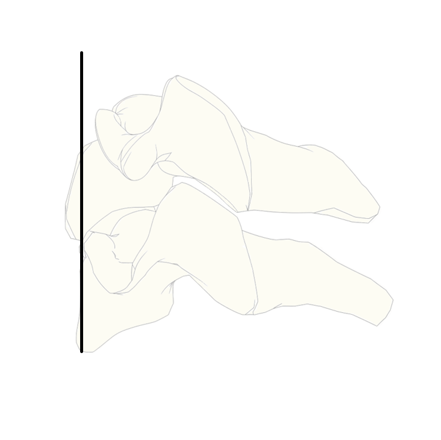{.absolute height="330" width="330" top="8%" left="1%" .fragment .fade-out fragment-index=1}

{.absolute height="330" width="330" top="48%" left="1%" .fragment .fade-out fragment-index=1}

::: r-stack

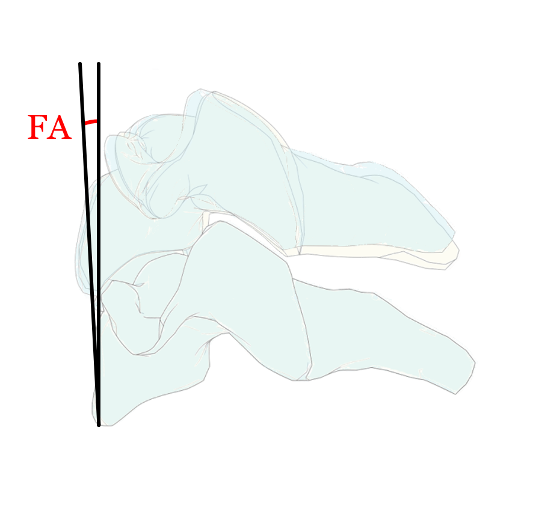{.fragment .fade-in-then-out .absolute height="330" width="330" top="8%" left="1%" fragment-index=1}

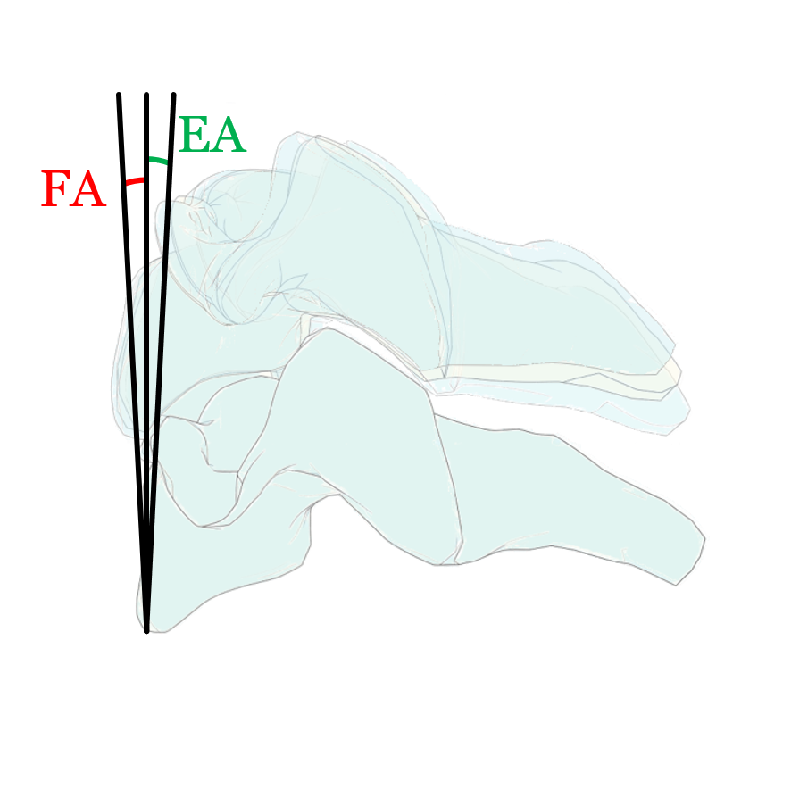{.fragment .fade-in .absolute height="330" width="330" top="8%" left="1%" fragment-index=2}

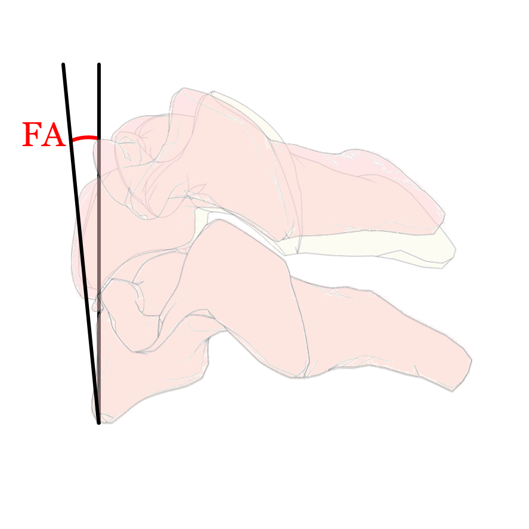{.fragment .fade-in-then-out .absolute height="330" width="330" top="48%" left="1%" fragment-index=1}

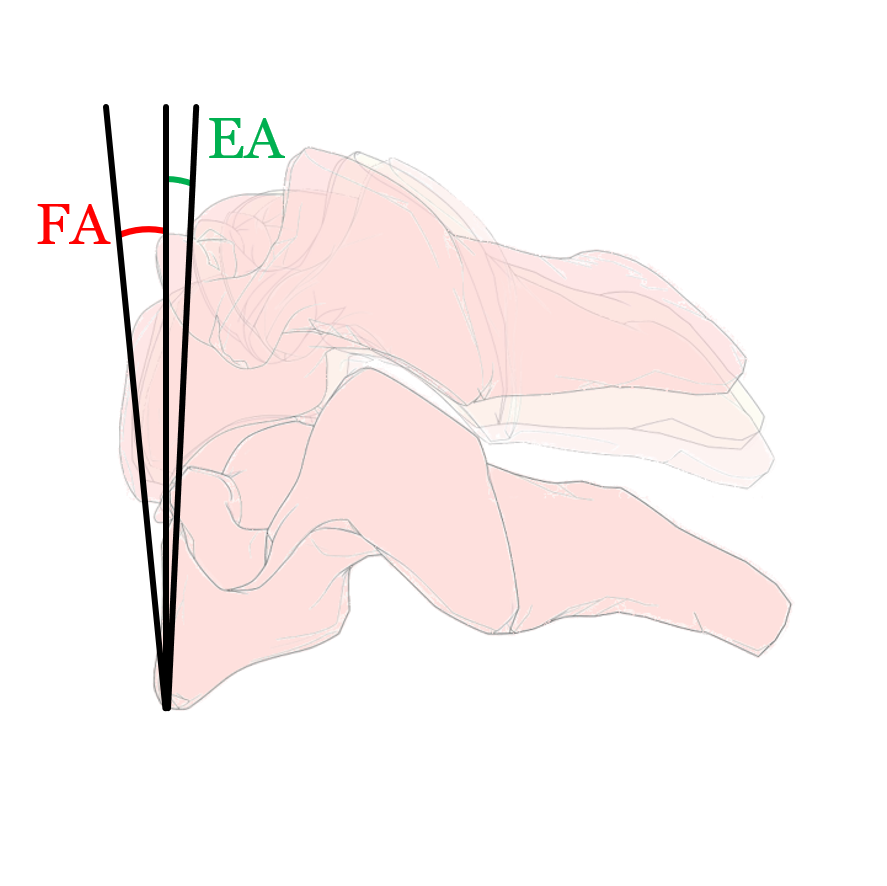{.fragment .fade-in .absolute height="330" width="330" top="48%" left="1%" fragment-index=2}

:::

::::

:::: {.column width="70%"}

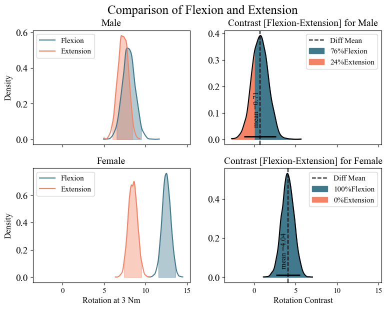{height="525"}

::::

:::::

::: aside

FSU figures are for illustrative purpose only!

:::

::: notes
meow meow
:::

## Contrast b/w Female & Male

::::: columns

:::: {.column width="30%"}

{.absolute height="330" width="330" top="8%" left="1%" .fragment .fade-out fragment-index=1}

{.absolute height="330" width="330" top="48%" left="1%" .fragment .fade-out fragment-index=1}

::: r-stack

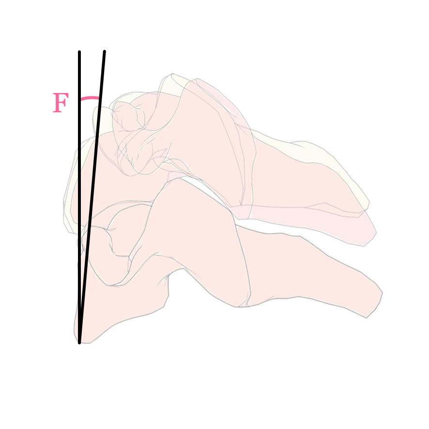{.fragment .fade-in-then-out .absolute height="330" width="330" top="8%" left="1%" fragment-index=1}

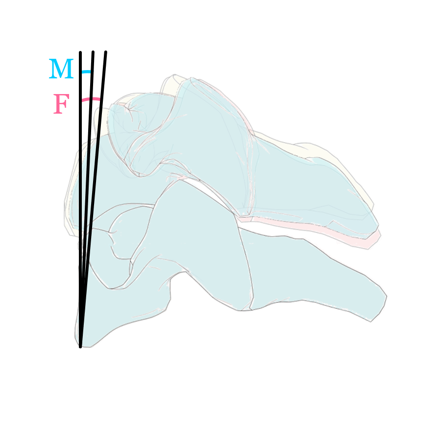{.fragment .fade-in .absolute height="330" width="330" top="8%" left="1%" fragment-index=2}

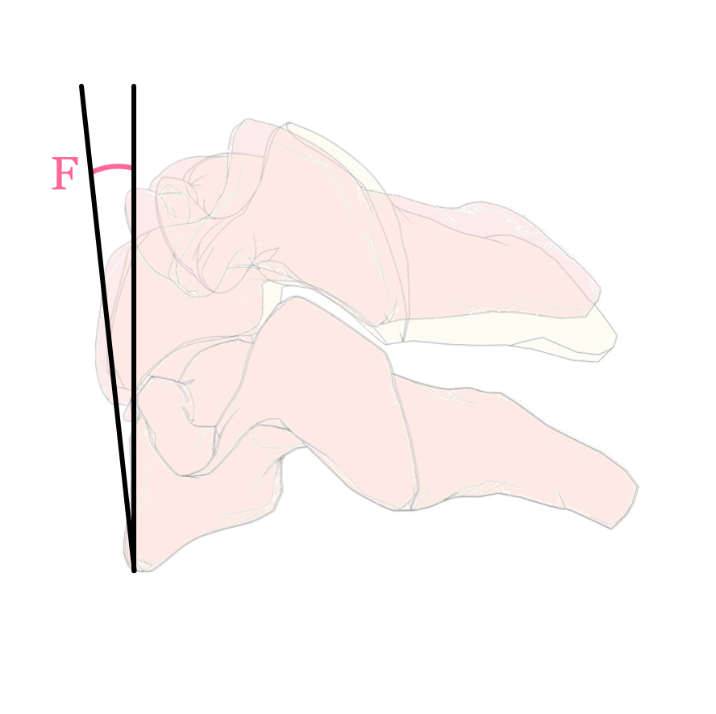{.fragment .fade-in-then-out .absolute height="330" width="330" top="48%" left="1%" fragment-index=1}

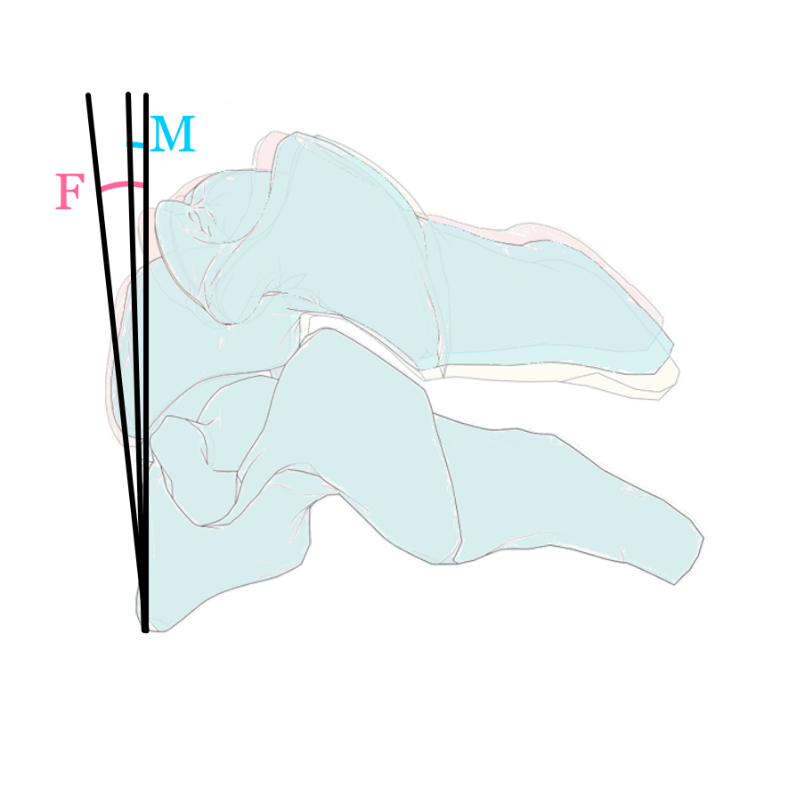{.fragment .fade-in .absolute height="330" width="330" top="48%" left="1%" fragment-index=2}

:::

::::

:::: {.column width="70%"}

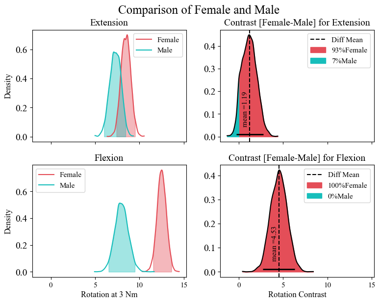{height="525"}

::::

:::::

::: aside

FSU figures are for illustrative purpose only!

:::

::: notes
meow meow
:::

## Conclusion

- Identified sexual dimorphism in cervical spine flexion–extension response using Bayesian model
- Male and female segments in extension tends to be similar
- But in flexion, the female rotation was 4.5° more 
than male in average.
- Female cervical spine segmental kinematics cannot be considered as size-scaled versions of male.

## Future Study

## Acknowledgement

