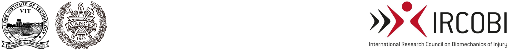
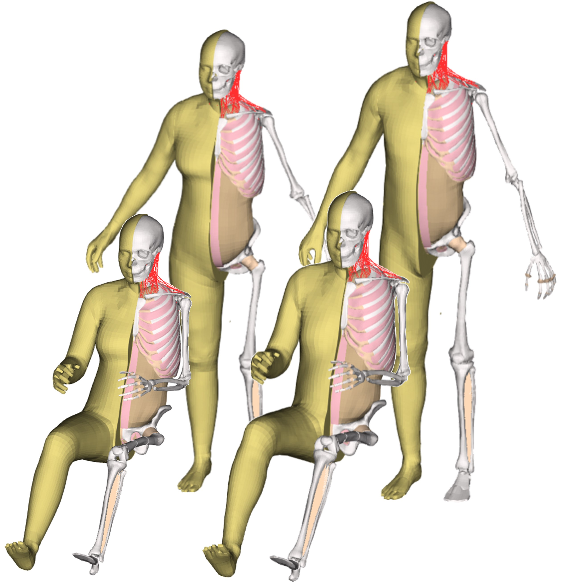
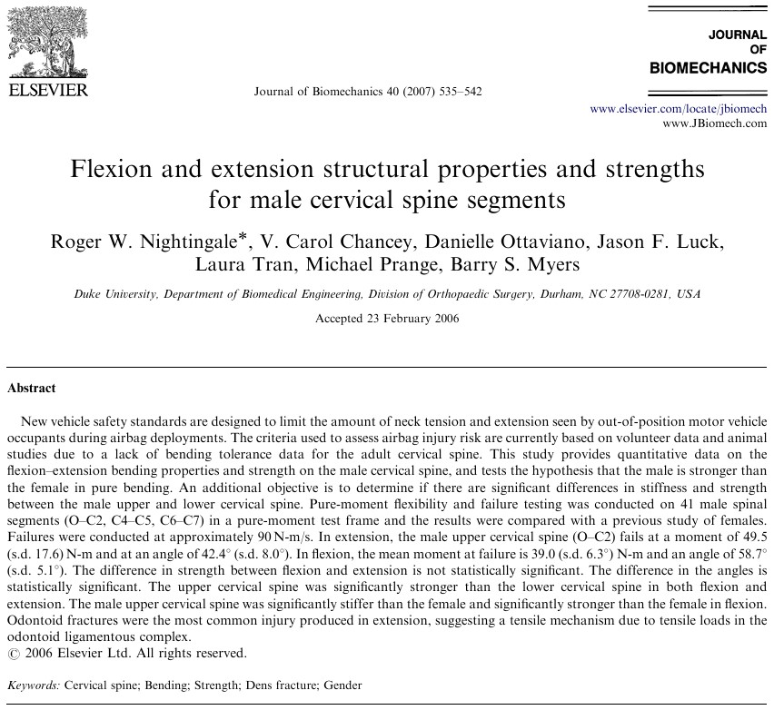

##  {background-color="white"}

 

::: {style="font-size: 1.5em;"}
**Comparison of Flexion–Extension Responses between Male and Female sub-Axial Cervical Spine Segments**
:::

 

[*Pranav Duraisamy*]{.underline}*, Davidson Jebaseelan, Jobin D. John*

::: footer
IRCOBI Europe 2025 \| Vilnius \| 11 Sept 2025
:::

## Introduction

:::::: columns
::: {.column width="50%"}
-   Recent dummies and HBMs also focus on average female
-   Male ⇌ Female HBM, *through Morphing*
-   Models were made to mimic *average female anthropometry*
:::

::: {.column width="50%"}

:::

::: notes
FE HBMs opens new possiblities in representing diverse populations. Most of the avg female HBMs are morphed from an avg male models, matching the node coords to represent a new anthropometry.. or sometimes vice versa from F to M.
:::
::::::

## Objective

Quantify the differences between the male and female cervical spine segments in flexion and extension

::: {.callout-tip title="Worth considering..."}
-   Female have more risk of neck injury male in traffic accidents
-   Generally, Sex-specific calibration and validation are either limited or non-existent
:::

::: notes
Just matching the anthropometry is not enough for a FE Model, We have to validate. but validating a F model remains a challange due to lack of F-specific experimental data. It is found to be common that Most of the studies analyzed without differentiating for sex (reported together). There are only few studies that have reported cervical spine response for F. Mostly M&F segments were used together for reporting or with no comparison between M&F.
:::

## A Bit of Background...

::: r-stack
{.fragment .absolute width="500" top="12%" left="15%"}

{.fragment .absolute width="500" top="40%" left="27%"}
:::

## A Bit of Background... {visibility="uncounted"}

::::: columns
:::: {.column width="60%"}

::: {style="font-size: 0.8em;"}
-   Both studies are identical, differing only in sex of the specimens used
-   Unembalmed cadavers, Adjacent segments were lost during sectioning
-   Flexibility Tests (Max. 3.5Nm) & Failure Tests (Loaded till failure)
:::

::: {.callout-note}
Male -  O–C3, C4–C5, and C6–C7

Female - O-C2, C3-C4, C5-C6, and C7-T1
:::

::::

:::: {.column width="40%"}
 

::::

:::::

::: notes
meow meow
:::

# Method

## Data Extraction

::: {.callout-tip title="Inclusion Criteria"}
-   Flexibility Tests
-   Rotation angle interpolated at 3Nm
-   Sub-Axial Cervical segments (C3 to C7)
:::

::: notes
meow meow
:::

## Exploratory Data Analysis

::: notes
meow meow
:::

## Bayesian Analysis - In short

::: notes
meow meow
:::

## Bayesian Model Building

::: notes
meow meow
:::

# Results

## Res

::: notes
meow meow
:::